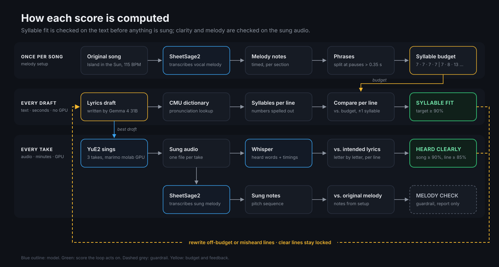
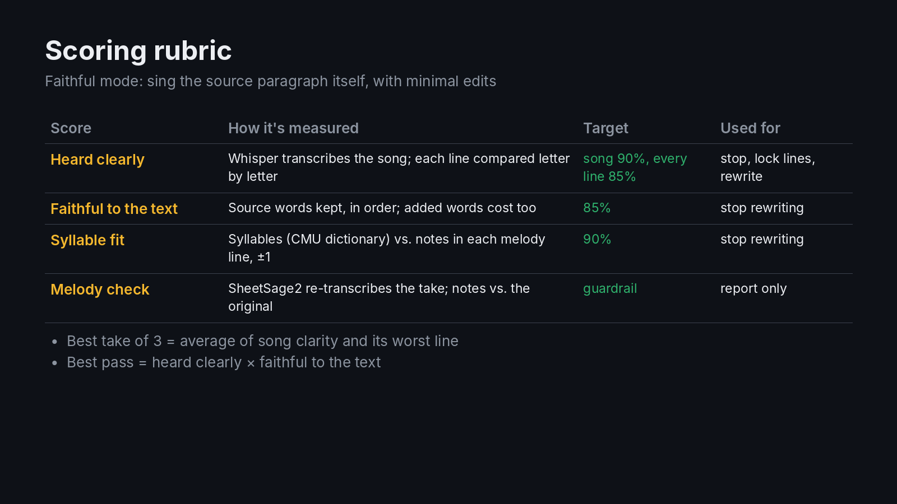

# yue2: listen to what you read

We're building an app to make and remix music. The question here: can it sing what you're reading?

Give it a paragraph from a web page or textbook. An autonomous loop sets the paragraph's own words to an
existing melody (the demo uses *Island in the Sun* by Weezer), sings it, listens back, and rewrites whatever
it can't hear clearly, until the song is clear, faithful to the text and fits the tune. Across songs, it
proposes rules for itself and keeps only the ones that win an A/B test.

**Traces and evaluations:** [Weave project](https://wandb.ai/sanatmouli-scoredata/yue2/weave).

## The loop

```
paragraph ──► TEXT PASSES (seconds, up to 4)
              Gemma 4 31B fits the source's words to the melody's phrases
              score: syllable fit · faithful to the text  ──► feedback ──► rewrite
                        │ best draft
              RENDER PASSES (minutes, up to 3)
              YuE2 sings 3 takes in parallel (new seeds each pass) on a marimo molab GPU
              Whisper checks every line; keep the clearest take; SheetSage2 melody guardrail
              lock clear lines ──► send misheard lines back with what was heard
                        │ best pass (heard clearly × faithful)
              karaoke player: song lines and the source words highlight as they're sung

across songs: coach proposes rules ──► A/B test on 40 first drafts from 8 new pages ──► keep if it helps
```

The writer sings the paragraph itself. Allowed edits: split sentences at pauses, drop filler words,
contractions, numbers and symbols written out as spoken; never paraphrase.

## Scoring rubric





| Score | How it's measured | Target | What the loop does with it |
|---|---|---|---|
| **Heard clearly** | Whisper transcribes the take; each line compared letter by letter, numbers spelled out on both sides | song ≥ 90%, every line ≥ 85% | stop; lock clear lines; feed back misheard lines |
| **Faithful to the text** | Source content words matched in order (LCS), F2 of kept vs. added | ≥ 85% | stop rewriting text |
| **Syllable fit** | CMU-dictionary syllables vs. notes per melody phrase, ±1 | ≥ 90% | stop rewriting text; line-level feedback |
| **Melody check** | SheetSage2 re-transcribes the take; notes vs. the original | guardrail | reported only |

Best of 3 takes = mean of song clarity and its worst line. Best pass = heard clearly × faithful. None of these
scores is graded by an LLM.

## Results

| What | Result |
|---|---|
| Scorer control test (fitted / medium / overstuffed lyrics) | heard clearly 1.00 → 0.28 → 0.00; melody check stays 0.96–0.99, so it is a guardrail, not a lyric signal |
| Faithfulness score sanity check | light trim 1.00, synonyms 0.67, paraphrase 0.08 |
| Faithful mode, Calvin cycle paragraph | heard clearly 0.17 at 115 BPM → 0.76 after 90 BPM, new seeds per pass and faithful feedback (faithfulness 0.81) |
| Faithful mode, Industrial Revolution paragraph | heard clearly 0.63 → 0.80 over 3 passes, faithfulness 0.88 |
| Tempo diagnostic, same lyrics | 115 BPM 0.17, 90 BPM 0.52 |
| Take variance, same lyrics | 0.22 to 0.81 across seeds |

### Bugs the evaluations caught
- **Rewrites undid earlier fixes** when every pass rewrote the whole song. Fixed by locking clear lines and
  rendering the best draft, not the last.
- **Faithful mode got stuck**: the listener asked to reword, faithful rules forbid it, and the same seed rendered
  the same song. Fixed with new seeds per pass and feedback that respects faithfulness.

### Not finished
- **The playbook experiments need a rerun.** The earlier runs scored rules with a fact-quiz mode that has since been
  removed; the rule A/B tests now use syllable fit and faithfulness, and have not been run yet.
- **The writer bake-off needs a rerun** on faithful-mode scores; Gemma 4 31B was chosen under the old scores.
- **No model weights were trained.** The loop learns rules, not parameters. Next step: fine-tune a small writer
  on the loop's best lyrics and serve it as a LoRA on W&B Inference.

## Layout

| Path | What |
|---|---|
| `sandbox/loop.py` | the loop (`run_faithful`): song plan, text and render passes, best-of-N takes |
| `sandbox/pipeline.py` | YuE2 render, syllable fit, SheetSage2 melody check, Whisper intelligibility (each model in its own venv) |
| `sandbox/faithful.py` | faithfulness score, number normalization, source-word spans for karaoke |
| `sandbox/melody.py` | melody profile: sections and phrases detected from the transcription; tempo control |
| `sandbox/asr_score.py` | Whisper transcript vs. intended lyrics, per line, with sung time spans |
| `sandbox/playbook.py`, `batch.py`, `experiment.sh` | coach, A/B-gated rule learning, batch runs logged as Weave evaluations |
| `sandbox/bakeoff.py` | Weave Evaluation of open-weight lyric writers on W&B Inference |
| `sandbox/singalong.py` | anywidget karaoke player |
| `notebook.py` | molab notebook with the demo UI (mode switch, paragraph picker, live progress, player) |
| `sandbox/demo_video.py`, `talk_segment.py` | demo video renderer (PIL + ffmpeg) and the Under the hood block |
| `tools/final_cut.py` | assembles the final video with the facecam recording, placed by word timestamps |
| `docs/demo-script.md` | voiceover script and rubric reference |
| `docs/rubric.png` | the rubric as an image |
| `docs/scoring-pipeline.svg` | diagram of how each score is computed |
| `sandbox/setup.sh`, `setup_asr.sh`, `transcribe.sh` | sandbox installs and source-track transcription |

## Setup

1. Open a notebook on [molab](https://molab.marimo.io/), attach the GPU, and choose **Pair with an agent**.
2. `cp .env.example .env` and fill in `WANDB_API_KEY` and `MARIMO_TOKEN`.
3. On the sandbox: `sandbox/setup.sh`, `sandbox/setup_asr.sh`, then `sandbox/transcribe.sh` on your source track.

molab sets `PYTHONSAFEPATH=1` and a kernel `PYTHONPATH` that leak into subprocess venvs, so sandbox scripts run
with `env -u PYTHONPATH -u PYTHONSAFEPATH`. molab sessions end after 12 hours (or 90 idle minutes) and take the
work folder with them; back up renders you want to keep.

## Licenses and rights

- This repo has no license file yet, so the code is all rights reserved by default. YuE2's code is Apache 2.0.
- **YuE2 and SheetSage2 weights are CC BY-NC 4.0**: noncommercial use only.
- The demo sets new lyrics to the melody of *Island in the Sun* (Weezer) for a noncommercial demo. The
  original recording is not distributed; audio files and transcribed scores of it are gitignored.
